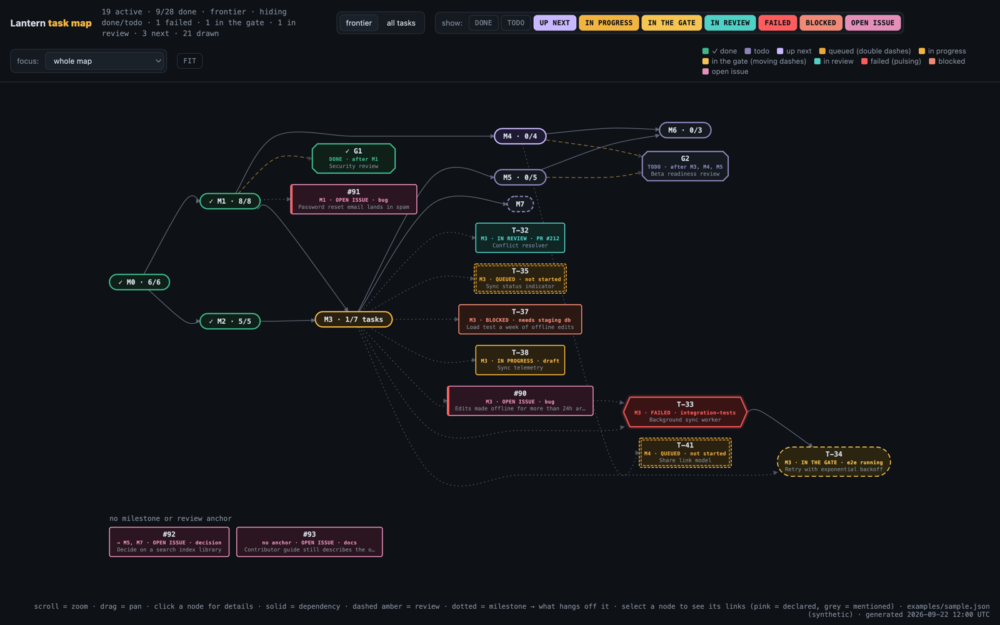

# task-map

An interactive dependency map of a project: milestones laid out left to right in the order they depend on each other, the work hanging off each one, and the state of every piece at a glance. Failed CI pulses red. Work waiting on checks crawls with moving dashes. Queued work sits in a double dashed box. One click on anything shows what it depends on, what it unblocks, and what links to it.



The map is one HTML file with no server and no dependencies. It reads one JSON file, so it works with any tracker: something has to turn your GitHub issues, Linear projects, Jira epics, or spreadsheet into that JSON, and that something is an **adapter**. This repo ships the page, the format, and a validator. The adapter is yours, and usually short.

## Try it

**[Open the live demo](https://jakemocode.github.io/task-map/)**: a sample project, nothing to install. To see your own data, open the **[empty viewer](https://jakemocode.github.io/task-map/dist/task-map.html)** and drop a task-map JSON file onto it; the file never leaves your browser.

Offline, the same two pages are `dist/sample.html` and `dist/task-map.html` in this repo.

The **frontier** view shows the whole spine plus only the work that needs attention: up next, in progress, in the gate, in review, failed, blocked, and open issues. **All tasks** adds finished and not-yet-ready work. The chips toggle each status on its own, and **focus** narrows the map to one milestone's upstream and downstream. Scroll zooms, drag pans, `f` fits, `Esc` closes the panel.

## Wire up your project

Hand the job to a coding agent: point it at `AGENTS.md`, which walks through choosing the spine, mapping every tracker state onto the nine statuses, deriving the edges, and checking the result. `docs/tracker-recipes.md` has starting mappings for GitHub, Linear, Jira, and spreadsheets.

Doing it by hand, the loop is:

```sh
your-adapter > map.json
node bin/validate.mjs map.json          # names every problem with its path
node bin/build.mjs map.json -o map.html # one self-contained file to open or share
```

Installed as a dependency (`npm install github:JakemoCode/task-map`), the same two tools are the commands `task-map-validate` and `task-map-build`. `docs/data-format.md` is the full reference. Node 22 or later runs the tools; the page needs only a browser.

## How it works

The adapter decides what everything *is*: which objects are milestones, what each status means, what depends on what. The page decides everything visual. It lays the graph out with [dagre](https://github.com/dagrejs/dagre), drops dependency edges already implied by a longer path so the spine stays readable, derives the dotted edges from each ticket's `parent`, and parks tickets with no anchor in a tray below the graph. Links between tickets and milestones stay hidden until you select one end, which is how the map shows a lot of relations without turning into a hairball.

## Development

```sh
npm test        # validator rules, build escaping, schema/validator agreement, dist/ freshness
npm run build   # refresh dist/ after changing src/
```

`AGENTS.md` has the rules for changing the format.

## License

MIT, see `LICENSE`. The bundled layout library is MIT licensed too; see `THIRD_PARTY_NOTICES.md`.
